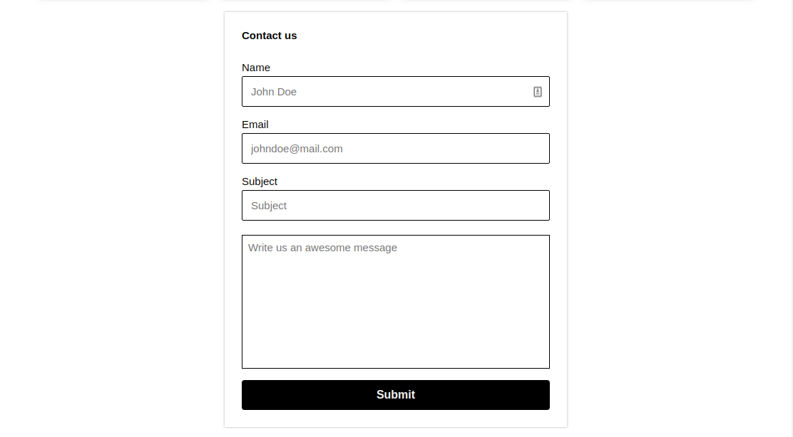

# 7Masters Contact Section Form

7Masters is a collaborative project made by Cohort 2 Platzi Master students in Ana Belisa's group.

The contact section form is responsible for allow us receive feedback about our work in 7Masters Blog

The component was developed using semantic HTML and vanilla CSS with features that offer us the CSS grid display. This component is completely responsive so anyone can write us an awesome message from any device.

